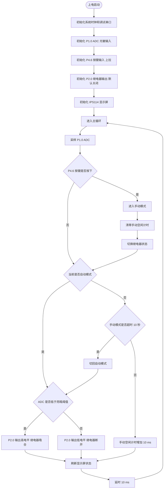

# 智能台灯流程图

```mermaid
flowchart TD
    A([上电启动]) --> B[初始化系统时钟和调试串口]
    B --> C[初始化 P1.0 ADC 光敏输入]
    C --> D[初始化 P4.6 按键输入 上拉]
    D --> E[初始化 P2.0 继电器输出 默认关闭]
    E --> F[初始化 IPS114 显示屏]
    F --> G[进入主循环]

    G --> H[采样 P1.0 ADC]
    H --> I{P4.6 按键是否按下}
    I -- 是 --> J[进入手动模式]
    J --> K[清零手动空闲计时]
    K --> L[切换继电器状态]
    I -- 否 --> M{当前是否自动模式}
    L --> M

    M -- 是 --> N{ADC 是否低于亮暗阈值}
    N -- 是 --> O[P2.0 输出高电平 继电器吸合]
    N -- 否 --> P[P2.0 输出低电平 继电器断开]

    M -- 否 --> Q{手动模式是否超时 10 秒}
    Q -- 是 --> R[切回自动模式]
    R --> N
    Q -- 否 --> S[手动空闲计时增加 10 ms]

    O --> T[刷新显示屏状态]
    P --> T
    S --> T
    T --> U[延时 10 ms]
    U --> G
```

## 引脚对应

| 功能 | 引脚 | 程序宏 |
| --- | --- | --- |
| 光敏 ADC | P1.0 | `ADC_P10` |
| 按键 | P4.6 | `IO_P46` |
| 继电器 | P2.0 | `IO_P20` |

